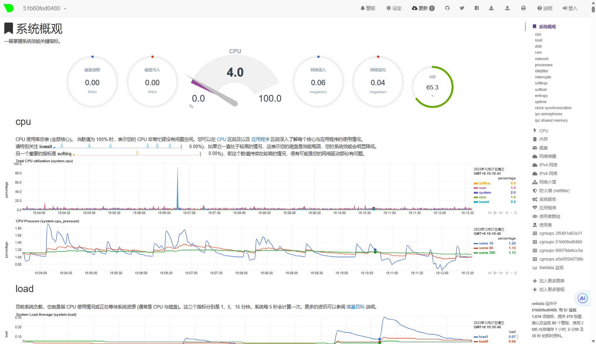
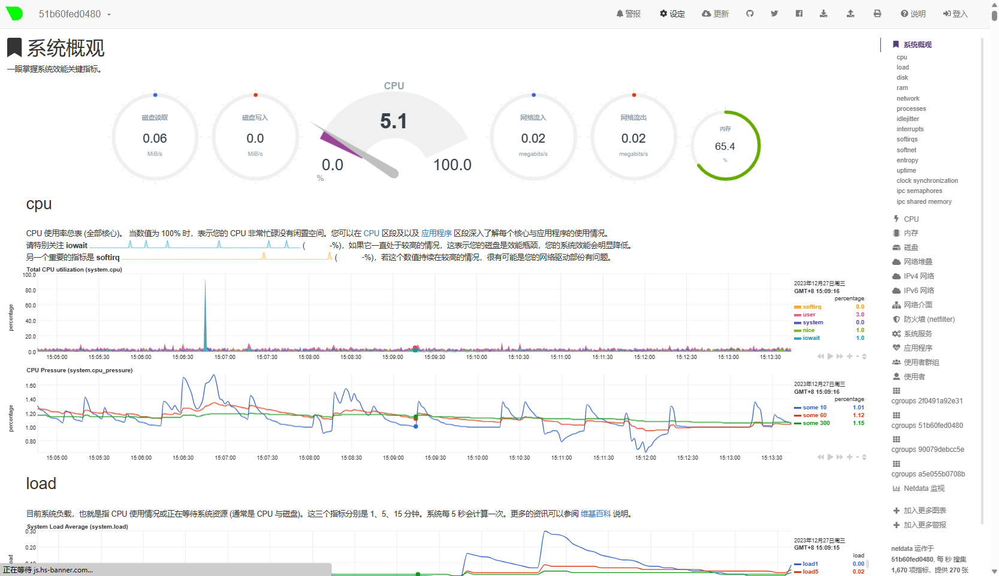
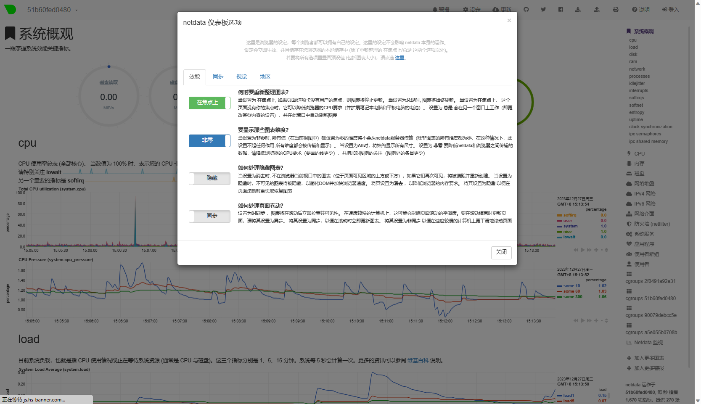
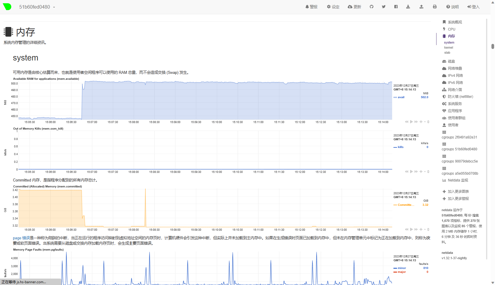

# netdata 简中汉化

适用于netdata版本：**`v1.32.1-37-nightly`** 。

netdata 是非常实用且实时的效能监视套件，对于每项效能指标不仅标示用途，更详细说明造成的原因以及影响，只可惜这么棒的说明全都是英文，相关汉化完成度也并不高，所以有了这个项目的产生。

几乎所有文本都有汉化。

## 使用说明

请将这四个文件下载后，覆盖至路径 '/usr/share/netdata/web/' ，请先备份，请先备份，请先备份。

- dashboard_info.js
- dashboard.js
- main.js
- index.html

docker中修改方法：

​	1、查看netdata容器id

​		`docker ps -a`

​	2、将下载文件复制到容器中

​		`docker cp 文件地址(例如：/tmp/dashboard.js) 容器id:/usr/share/netdata/web/`

​	3、重启netdata容器

​		`docker restart netdata

​	注意：此方法只适用当前容器的netdata，重新创建netdata容器需要再次进行上诉操作。

完成后，请清除浏览器缓存后再访问。

## 画面展示

